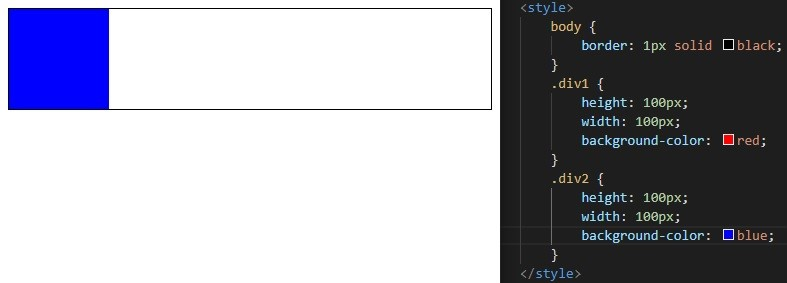

# CSS2

## CSS Position

- 문서 상에서 요소의 위치를 지정
- static : 모든 태그의 기본 값
  - 일반적인 요소의 배치 순서에 따름(좌측 상단)
  - 부모 요소 내에서는 부모 요소의 위치를 기준으로 배치됨

- relative : 상대 위치
  - 자기 자신의 static 위치를 기준으로 이동
  - normal flow 유지
  - 레이아웃에서 요소가 차지하는 공간은 static일때와 같음(normal position 대비 offset)

- absolute : 절대 위치
  - 요소가 일반적인 문제 흐름에서 제거된 후 레이아웃에 공간을 차지하지 않음
  - normal flow 벗어남 -> 다음 블록 요소가 좌측 상단으로 붙음
  - static이 아닌 가장 가까이 있는 부모/조상 요소를 기준으로 이동, 없는 경우 브라우저 화면 기준으로 이동

- fixed : 고정 위치
  - 요소를 일반적인 문서 흐름에서 제거 후 레이아웃에 공간을 차지하지 않음
  - normal flow에서 벗어남
  - 부모 요소와 관계없이 viewport를 기준으로 이동
  - 스크롤 시에도 항상 같은 곳에 위치

- sticky : 스크롤에 따라 static -> fixed로 변경
  - 속성을 적용한 박스는 평소에 문서 안에서 position : static 상태와 같이 일반적인 흐름에 따르지만 스크롤 위치가 임계점에 이르면 position : fixed와 같이 박스를 화면에 고정할 수 있는 속성
  - 일반적으로 Navigation bar에서 사용됨

- absolute vs relative

## CSS Layout

- Float
  - 박스를 왼쪽 혹은 오른쪽으로 이동시켜 텍스트를 포함 인라인 요소들이 주변을 wrapping하도록 함
  - 요소가 normal flow를 벗어나도록 함

- Flexbox

  - 행과 열 형태로 아이템들을 배치하는 1차원 레이아웃 모델

  - 축

    - 메인 축
    - 교차 축

  - 구성 요소

    - Flex Container (부모 요소)  : display에 flex 혹은 inline-flex

    - Flex Item (자식 요소)
    
  - 이전까지 Normal Flow를 벗어나는 수단은 float 혹은 position
  
  - 하기 어려웠던 것 : 수직 정렬, 아이템의 너비와 높이 혹은 간격을 동일하게 배치하는 것

  - Flex 속성

    - flex-direction : main axis의 방향 설정
    - row(기본), row-reverse, column, column-reverse
  
  
  
  - flex-wrap : 아이템이 컨테이너를 벗어나는 경우 해당 영역 내에 배치되도록 설정
      - wrap : 넘치면 그 다음 줄로 배치
      - nowrap(기본) : 한 줄로 배치
    - wrap-reverse
    
  
  
  
    - justify-content : **main axis**를 기준으로 공간 배분
      - flex-start(기본), flex-end, center, space-between, space-around, space-evenly
  
    
  
    - align-content : cross axis를 기준으로 공간 배분
    - align-items : 모든 아이템을 **cross axis** 기준으로 정렬
    - stretch, flex-start, flex-end, center, baseline
  
  
  
    - align-self : **cross axis** 기준으로 **개별** 아이템 정렬
    - stretch, flex-start, flex-end, center
    - flex-grow : 남은 영역을 아이템에 분배
  - order : 배치 순서, flex-direction 순서대로 가장 낮은 값부터 정렬, 기본 0