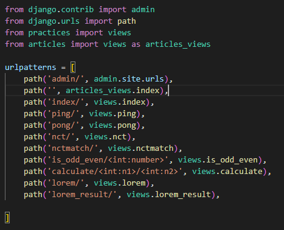

# Django 04

## App URL mapping

- app의 view함수가 많아지면서 사용하는 path() 또한 많아지고, app도 늘어나기 때문에 프로젝트의 urls.py에서 모두 관리하는 것은 프로젝트 유지보수에 좋지 않음

  ```python
  # 이렇게 해도 되지만 이거 말고...
  from articles import views as article_views
  from pages import views as pages_views
  
  urlpatterns = [
      path('pages-index/', pages_views.index)
  ]
  ```

- 각각의 app 폴더 안에 urls.py를 넣음, 프로젝트의 urls.py에서 각 앱의 urls.py파일로 URL 매핑을 위탁

- include되는 앱의 url.py에 urlpatterns가 작성되어 있지 않다면 에러 발생, 빈 리스트라도 작성

  ```python
  # articles/urls.py
  from django.urls import path
  from . import views
  
  urlpatterns = [
      path('index/', views.index),
      path('greeting/', views.greeting),
      ....
  ]
  
  # pjt/urls.py
  from django.contrib import admin
  from django.urls import path, include
  
  urlpatterns = [
      path('admin/', admin.site.urls),
      path('articles/', include('articles.urls')),
      path('pages/', include('pages.urls')),
  ]
  ```

- /index/ -> /articles/index/로 메인 페이지의 주소가 바뀜
- include()
  - 다른 URLconf(app/urls.py)들을 참조할 수 있도록 돕는 함수
  - 함수 include()를 만나게 되면 URL의 그 시점까지 일치하는 부분을 잘라내고 남은 문자열 부분을 후속 처리를 위해 include된 URLconf로 전달

## Templates namespace

- Django는 기본적으로 app_name/templates/경로에 있는 templates 파일들만 찾을 수 있으며, settings.py의 INSTALLED_APPS에 작성한 app 순서로 template을 검색 후 렌더링함

  - 같은 이름의 template인데 경로를 명시해 놓아도 먼저 작성한 app의 template를 렌더링

  

- 여러 앱에서 같은 이름의 템플릿 파일이 존재할 수 있기 때문에 template namespace 고려

  ```python
  # settings.py
  TEMPLATES = [{
      ...
      'APP_DIRS' : True,
      ...
  }]
  ```

- Django templates의 기본 경로에 app과 같은 이름의 폴더를 생성해 폴더 구조를 app_name/templates/app_name/ 형태로 변경

- 폴더 구조 변경 후 변경된 경로로 해당하는 모든 부분 수정

  ```python
  # articles/views.py
  return render(request, 'articles/index.html')
  ```


- BASE_DIR