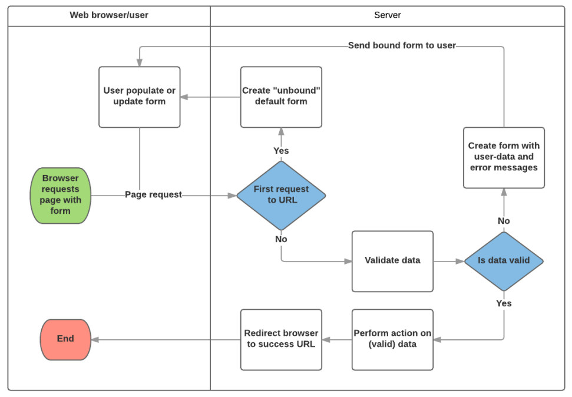

# Django7

## Django ModelForm

- DB 기반의 어플리케이션을 개발하다보면, HTML Form(UI)는 DJango의 모델(DB)와 매우 밀접한 관계를 가지게 됨
  - 사용자로부터 값을 받아 DB에 저장하여 활용하기 때문
  - 즉 모델에 정의한 필드의 구성 및 종류에 따라 HTML Form이 결정됨
- 사용자가 입력한 값이 DB의 데이터 형식과 일치하는지를 확인하는 유효성 검증이 반드시 필요하며  이는 서버 사이드에서 반드시 처리해야 함
- Model을 통해 Form Class를 만들 수 있는 helper class
- ModelForm은 Form과 똑같은 방식으로 View함수에서 사용

```python
# articles/forms.py
from django import forms
from .models import Article

class ArticleForm(forms.ModelForm):
    class Meta:
        model = Article
        # 모델의 모든 필드를 포함
        fields = '__all__'
        # 포함하지 않을 필드 지정
        exclude = ('title', )
```

1. ModelForm 객체를 context로 전달

```python
# articles/views.py
from .forms import ArticleForm

def new(request):
    form = ArticleForm()
    context = {'form' : form, }
    return render(request, 'articles/new.html', context)
```

2. Input Field 활용

```html
<!-- articles/new.html -->
<form action="" method="POST">
    
    {{ form.as_p }}
    <input type="submit">
</form>
```

- <label> & <input> 쌍에 대한 3가지 출력 옵션
  - as_p() : 각 필드가 p태그로 감싸져서 렌더링
  - as_ul() : 각 필드가 li태그로 감싸져서 렌더링, ul태그는 직접 작성
  - as_table() : 각 필드가 tr태그로 감싸져서 렌더링

- 저장 및 활용

```python
form = ArticleForm()
article = Article.objects.get(pk=1)
form = ArticleForm(instance=article)

f = ArticleForm(request.POST)
new_article = f.save()

a = Article.objects.get(pk=1)
f = ArticleForm(request.POST, instance=a)
f.save()
```

## ModelForm with view functions



- CREATE

  - 유효성 검사를 통과하면 데이터 저장 후 상세 페이지로 리다이렉트
  - 통과하지 못하면 작성 페이지로 리다이렉트
  - ModelForm의 instance가 있으면 해당 인스턴스를 수정, 없을 시 새 인스턴스를 만듬

  ```python
  # articles/views.py
  def create(request):
      form = ArticleForm(request.POST)
      if form.is_valid():
          article = form.save()
          return redirect('articles:detail', article.pk)
     	# 유효성 검증 실패 원인 출력
      print(form.errors)
     	return redirect('articles:new')
  
  def create(request):
      form = ArticleForm(request.POST)
      if form.is_valid():
          article = form.save()
          return redirect('articles:detail', article.pk)
      context = {'form' : form,}
     	return render(request, 'articles/new.html', context)
  ```

- UPDATE

  - edit

  ```python
  def edit(request, pk):
      article = Article.objects.get(pk=pk)
      form = ArticleForm(instance=article)
      context = {
          'article' : article,
          'form' : form,
      }
      return render(request, 'articles/edit.html', context)
  ```

  ```html
  <form action="" method="POST">
      
      {{ form.as_p }}
      <input type="submit">
  </form>
  ```

  - update

  ```python
  def update(request, pk):
      article = Article.objects.get(pk=pk)
      form = ArticleForm(request.POST, instance=article)
      if form.is_valid():
          form.save()
          return redirect('articles:detail', article.pk)
      context = {
          'form' : form,
          'article' : article,
      }
      return render(request, 'articles/edit.html', context)
  ```

  