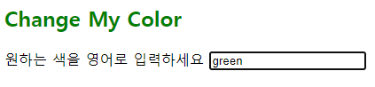

# JavaScript Event

- 네트워크 활동이나 사용자와의 상호작용 같은 사건의 발생을 알리기 위한 객체
- 이벤트 발생
  - 마우스 

- 이벤트의 역할
  - ~ 하면 ~ 한다 ex) 클릭하면 경고창을 띄운다
  - 특정 이벤트가 발생하면 할 일(함수)을 등록한다
- `EventTarget.addEventListener(type, listener[, options])`
  - type : 반응할 이벤트 유형
  - listener : 지정된 타입의 이벤트가 발생했을 때 알림을 받는 객체, Eventlistener 인터페이스 혹은 JS function 객체(콜백 함수)여야 함

```html
// 1
<body>
    <button type="button">버튼</button>
    <script>
        const btn = document.querySelector('button')
        btn.addEventListener('click', function(event){
            alert('버튼이 클릭되었습니다')
            console.log(event)
        })
    </script>
</body>

// 2
<body>
    <button onclick="alertMessage()">나를 눌러봐!</button>
	<button id="my-button">나를 눌러봐!!</button>

	<script>
        const alertMessage = function(){
            alert('메롱')
        }
        const myButton = document.querySelector('#my-button')
        myButton.addEventListener('click', alertMessage)
	</script>
</body>

// 3
<body>
    <p id="my-paragraph"></p>
    <form action="#">
        <label for="my-text-input">내용을 입력하세요.</label>
        <input id="my-text-input" type="text">
    </form>
    <script>
        const myTextInput = document.querySelector('#my-text-input')
        myTextInput.addEventListener('input', function(event){
            const myPtag = document.querySelector('#my-paragraph')
            myPtag.innerText = event.target.value
        })
    </script>
</body>
```


```html
// 4
<body>
    <h2>Change My Color</h2>
    <label for="change-color-input">원하는 색을 영어로 입력하세요</label>
    <input id="change-color-input">
    <script>
        const colorInput = document.querySelector('#change-color-input')
        const changeColor = function(event){
            const h2Tag = document.querySelector('h2')
            h2Tag.style.color = event.target.value
        }
        colorInput.addEventListener('input', changeColor)
    </script>
</body>
```



```html
// 5 Event 취소 - 못하게 막아놓음
<body>
    <input type="checkbox" id="my-checkbox">
    <script>
        const checkBox = document.querySelector('#my-checkbox')
        checkBox.addEventListener('click', function(event){
            event.preventDefault()
        })
    </script>
</body>

// 6 - 제출 누르면 input창이 비워짐
<body>
    <form action="/articles/" id="my-form">
        <input type="text">
        <input type="submit" value="제출">
    </form>
    <script>
        const formTag = document.querySelector('#my-form')
        formTag.addEventListener('submit', function(event){
            event.preventDefault()
            event.target.reset()
        })
    </script>
</body>
```

-  취소할 수 없는 이벤트도 존재