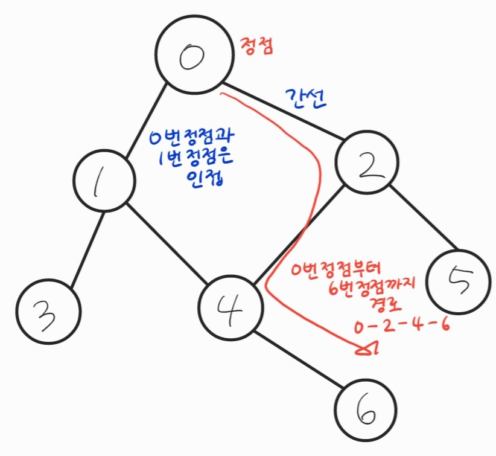
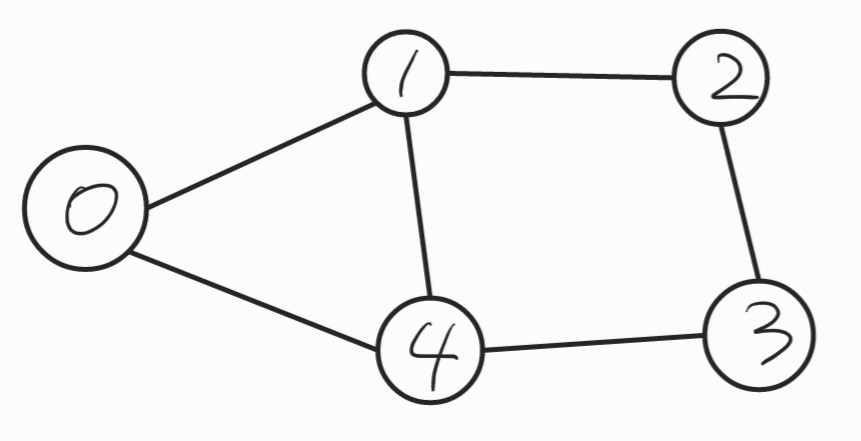
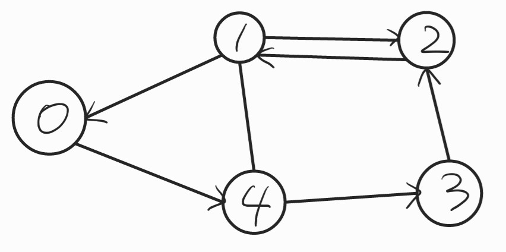

# 그래프

## 1. 그래프에 대한 이해

그래프 : 정점(Vertex)과 이를 연결하는 간선(Edge)들의 집합으로 이루어진 비선형 자료구조

- 정점(Vertex) : 간선으로 연결되는 객체이며 노드(Node)라고도 함
- 간선(Edge) : 정점 간의 연결을 표현하는 선
- 경로(Path) : 시작 정점부터 도착 정점까지 거치는 정점을 나열한 것
- 인접(Adjacency) : 두 개의 정점이 하나의 간선으로 직접 연결된 상태



## 2. 그래프의 종류

1. 무방향 그래프(Undirected graph)
   - 간선의 방향이 없는 가장 일반적인 그래프
   - 간선을 통해 양방향의 정점 이동 가능
   - 차수(Degree) : 하나의 정점에 연결된 간선의 개수
   - 모든 정점의 차수의 합 = 간선 수 * 2

   

2. 유방향 그래프(Directed graph)
   - 간선의 방향이 있는 그래프
   - 간선의 방향이 가리키는 정점으로 이동 가능
   - 차수 
     - 진입 차수(In-degree) : 외부 정점에서 한 정점으로 들어오는 간선의 수
     - 진출 차수(Out-degree) : 한 정점에서 외부 정점으로 나가는 간선의 수

   

## 3. 그래프의 표현

1. 인접 행렬(Adjacement matrix)

   두 정점을 연결하는 간선이 없으면 0, 있으면 1을 가지는 행렬로 표현하는 방식
   
   직관적이고 만들기 편하지만, 불필요하게 공간이 낭비

``` python
    # 무방향 그래프
    edges = [[0, 1], [0, 2], [1, 3], [1, 4], [2, 4], [2, 5], [4, 6]]
    n = 7 # 정점
    m = 7 # 간선
    matrix = [[0] * n for _ in range(n)]
    for i in range(m):
        v1, v2 = edges[i][0], edges[i][1]
        matrix[v1][v2] = 1
        matrix[v2][v1] = 1
   >>> matrix = [
       [0, 1, 1, 0, 0, 0, 0],
       [1, 0, 0, 1, 1, 0, 0],
       [1, 0, 0, 0, 1, 1, 0],
       [0, 1, 0, 0, 0, 0, 0],
       [0, 1, 1, 0, 0, 0, 1],
       [0, 0, 1, 0, 0, 0, 0],
       [0, 0, 0, 0, 1, 0, 0]
   ]
```

2. 인접 리스트

   리스트를 통해 각 정점에 대한 인접 정점들을 순차적으로 표현하는 방식

   연결된 정점만 저장하여 효율적
   
   ```python
   # 무방향 그래프
   edges = [[0, 1], [0, 2], [1, 3], [1, 4], [2, 4], [2, 5], [4, 6]]
   n = 7 # 정점
   m = 7 # 간선
       
   graph = [[] for _ in range(n)]
   for i in range(m):
       v1, v2 = edges[i][0], edges[i][1]
       graph[v1].append(v2)
       graph[v2].append(v1)
   
   >>> [[1, 2], [0, 3, 4], [0, 4, 5], [1], [1, 2, 6], [2], [4]]
   ```
