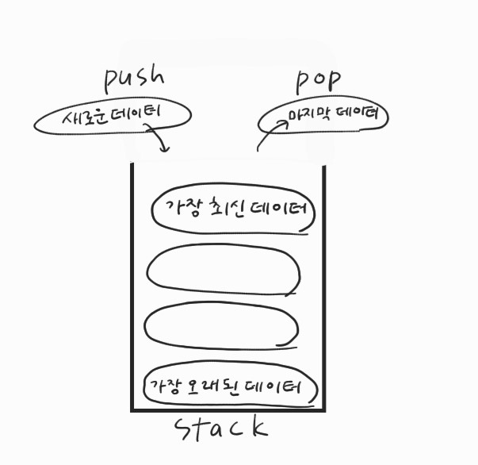
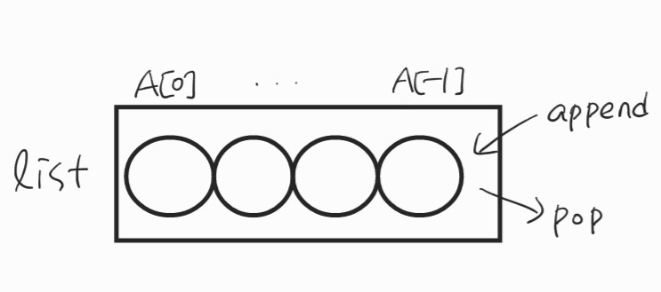
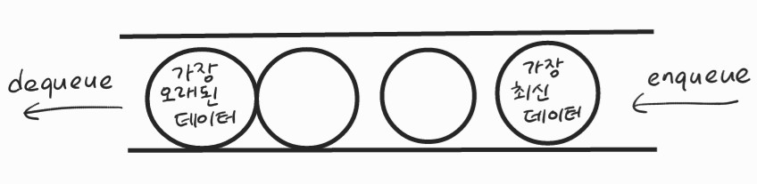
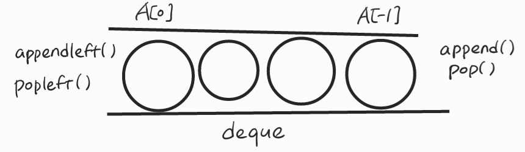

# 스택, 큐

## 1. 스택(Stack)

스택은 쌓는다는 의미, 마치 접시를 쌓고 빼듯이 데이터를 한쪽에서만 넣고 빼는 자료구조

가장 마지막에 들어온 데이터가 가장 먼저 나가므로 LIFO(last-in first-out, 후입선출) 방식

- push : 새로운 데이터 삽입
- pop : 가장 마지막에 들어온 데이터를 가져오기



- 스택이 필요한 이유
  - 뒤집기, 되돌리기, 되돌아가기, 뒤로가기, ctrl + z
  - 마무리되지 않은 일을 임시 저장 : 괄호 매칭, 함수 호출(재귀 호출), dfs, 백트래킹
- 파이썬은 리스트로 스택을 간편하게 사용할 수 있음 : `append()`, `pop()`



## 2. 큐(Queue)

한 쪽 끝에서 데이터를 넣고 반대쪽에서 데이터를 뺄 수 있는 자료구조

가장 먼저 들어온 데이터가 가장 먼저 나가므로 FIFO(first-in first-out, 선입선출) 방식

- dequeue : 큐의 맨 앞 데이터를 가져오기

- enqueue : 큐의 맨 뒤에 데이터를 삽입하기




- 파이썬은 리스트로 큐를 간편하게 사용할 수 있음 : `append()`, `pop(0)`

- 덱 자료구조 : 양 방향으로 삽입과 삭제가 자유로운 큐, 큐보다 훨씬 빠름





```python
from collections import deque
queue = deque([1, 2, 3, 4, 5])
queue.popleft()
queue >>> deque([2, 3, 4, 5])
queue.append(6)
queue >>> deque([2, 3, 4, 5, 6])
```

